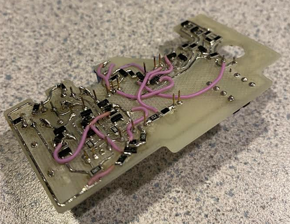
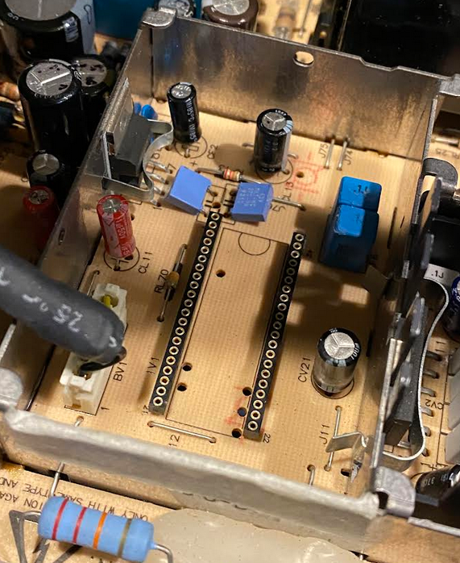
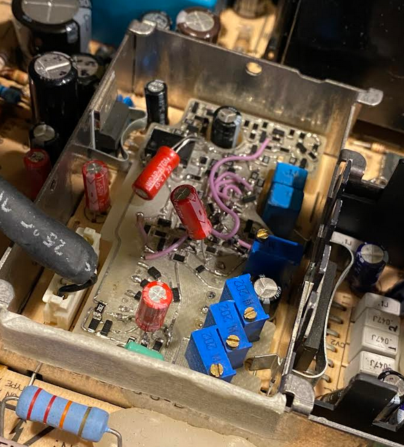

# colorclassic_video_processor
Project for the reverse-engineering of the Macintosh Color Classic's CRT video processor
# ColorClassic Video Processor
#
colorclassic_video_processor is an ongoing reverse‑engineering project to recreate the functionality of the XC1186B video processor found on the Macintosh Color Classic analog board by designing a replacement PCB that is pin‑compatible with the XC1186B. The goal is not a circuit‑for‑circuit replica but a practical drop‑in replacement that reproduces the processor’s essential behavior (with some features intentionally simplified or omitted and the possibility of adding new capabilities). Development has progressed to the point where the vast majority of features have been implemented, enabling a Color Classic to generate all required CRT signals for 640×480 VGA operation on machines that were previously modded for that mode. Other resolutions should work, as well, but have not yet been tested. The horizontal deflection pulse, vertical deflection sawtooth waveform, and RGB pre-amps are some of the major circuit subsystems that have been implemented. With little available documentation on the XC1186B itself, functionality had to be initially infered through a long process of signal measurement, route tracing, enabling/disabling various circuit sections, and reproduction of parts of the analog board's schematic. Much of that work will be documented here, albeit most of it after the fact. As of October 2025, a home-made prototype PCB with hand-assembled components has been tested and modified with ongoing improvements and optimization. More work will be done to add features, improve performance, and make the PCB design more production-friendly.
#

 
CNC-prototyped, hand-assembled PCBA. Bodge wires and rework were required to bring design up to the latest rev described in this document.
  

 
Bottom side of the PCBA, showing pins and additional circuitry.
  

 
The video "cage" on the analog board, showing the original XC1186B removed and 2x 21 pin sockets installed for quick installation and removal of the custom PCBA.
  

 
The custom PCBA installed in the sockets.
  
[Main Schematic and Sub-Circuits](sub_circuits.md)
