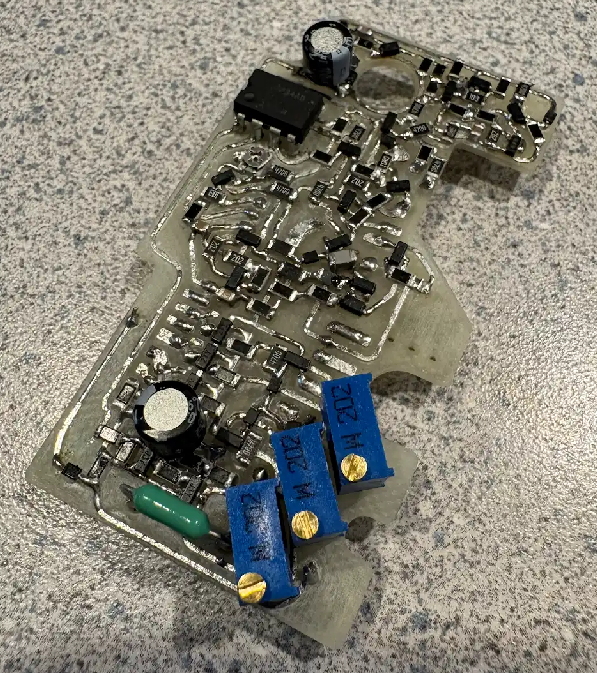
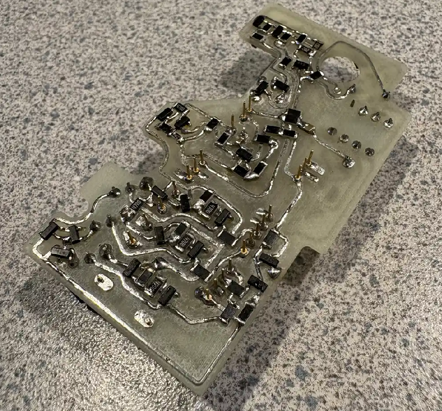
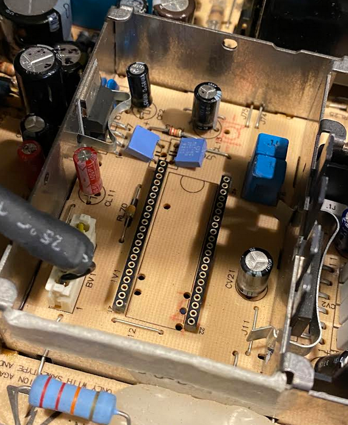
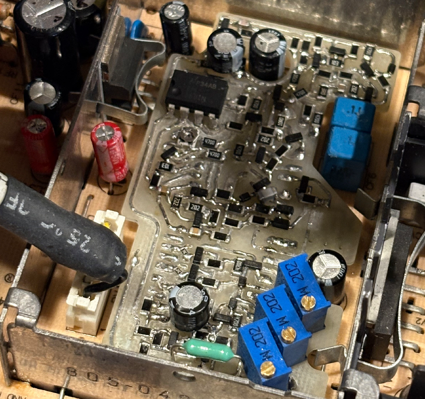
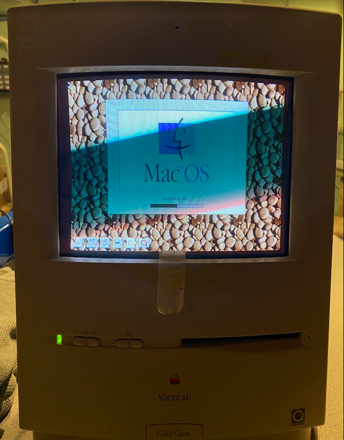

# colorclassic_video_processor
Project for the reverse-engineering of the Macintosh Color Classic's CRT video processor
# Color Classic Video Processor
#
colorclassic_video_processor is an ongoing reverse‑engineering project to recreate the functionality of the XC1186B video processor found on the Macintosh Color Classic analog board by designing a replacement PCB that is pin‑compatible with the XC1186B. The goal is not a circuit‑for‑circuit replica but a practical drop‑in replacement that reproduces the processor’s essential behavior (with some features intentionally simplified or omitted and the possibility of adding new capabilities). Development has progressed to the point where the vast majority of features have been implemented, enabling a Color Classic to generate all required CRT signals for 640×480 VGA operation on machines that were previously modded for that mode. Other resolutions should work, as well, but have not yet been tested. The horizontal deflection pulse, vertical deflection sawtooth waveform, and RGB pre-amps are some of the major circuit subsystems that have been implemented. With little available documentation on the XC1186B itself, functionality had to be initially infered through a long process of signal measurement, route tracing, enabling/disabling various circuit sections, and reproduction of parts of the analog board's schematic. (See my latest partial analog board schematic [here](https://github.com/jonschultz/colorclassic_video_processor/blob/main/CC_analog_video_section_20260513A.pdf)). Much of that work will be documented here, albeit most of it after the fact. As of May 2026, multiple revisions of a home-made prototype PCB with hand-assembled components have been tested and modified with ongoing improvements and optimization. The latest is "Version3". More work might be done in the future to add features, improve performance, and make the PCB design more production-friendly.  

## Current Capabilities (v3)
* Support for 640x480 resolution at 60Hz refresh on VGA-modded Color Classics 
* Brightness and Contrast adjustment functional by way of MacOS software controls, such as through the "Screen" control panel. Contrast adjustments are also functional by way of the front bezel buttons. 
* Large dynamic range adjustment of individual RGB channel gain is available using on-board potentiometers. 
* Large dynamic range coarse adjustment of vertical height is available using an on-board potentiometer. The "VH" pot on the rear of the analog board is also functional for fine-tuning. 
* All geometry adjustment functions by way of the Color Classic's analog board rear potentiometers are functional. 
* Many of the color adjustment functions by way of the Color Classic's analog board rear potentiometers are currently functional, except for "Green Gain" and "Blue Gain". 
* Very high bandwidth RGB preamps on-board, providing very sharp images and exceptional color reproduction. 
* Additional on-board geometry adjustment for "warp", using input from the TDA8145 IC on the Color Classic analog board. 

## Coming Soon
* Support for other common resolutions, including 512x384, with less adjustment required between resolution/mode changes. 
* Possible support for the "Green Gain" and "Blue Gain" analog board potentiometers. 
* See [Future and Ongoing Work](future.md)  

#

 
CNC-prototyped, hand-assembled PCBA. The outline of the PCB is quite unusual, in order maximize board area within the video "cage", while providing clearance to other nearby discrete components.
   

 
Bottom side of the PCBA, showing pins and additional circuitry.
   

 
The video "cage" on the analog board, showing the original XC1186B removed and 2x 21 pin sockets installed for quick installation and removal of the custom PCBA.
   

 
The custom PCBA installed in the sockets.
   

 
Running with the colorclassic_video_processor, during boot.
   
#
[Image Gallery](gallery.md)
 
[Main Schematic and Sub-Circuits](sub_circuits.md)
 
[Fabrication Files and Notes](fabrication.md)
 
[Installation and Setup](setup.md)
 
[Future and Ongoing Work](future.md)
 
