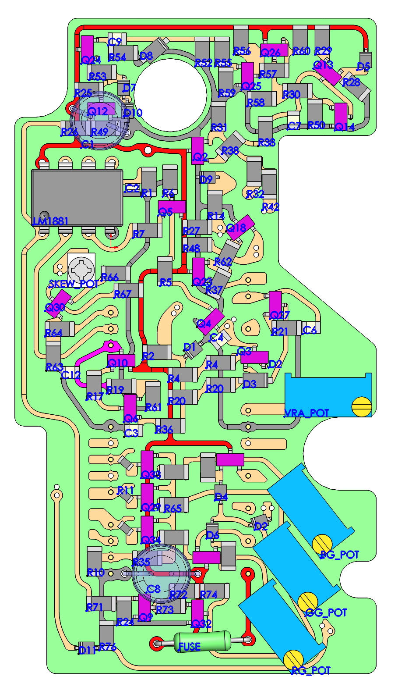
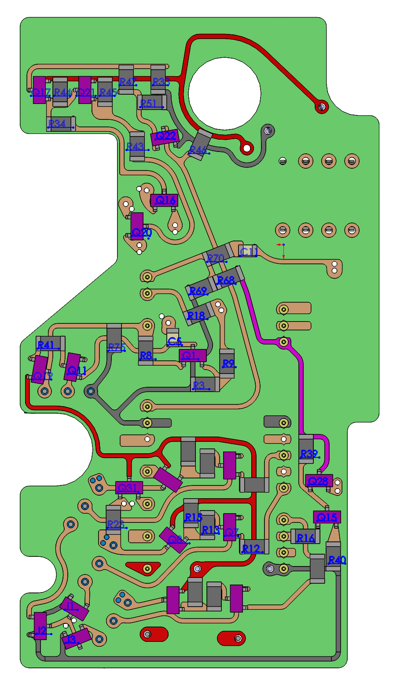
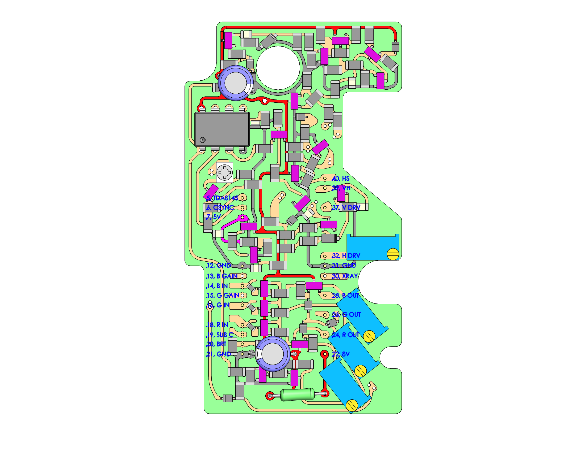
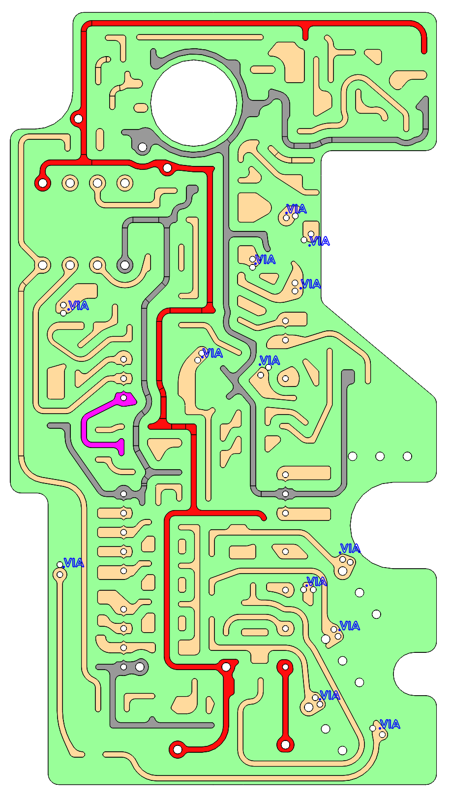
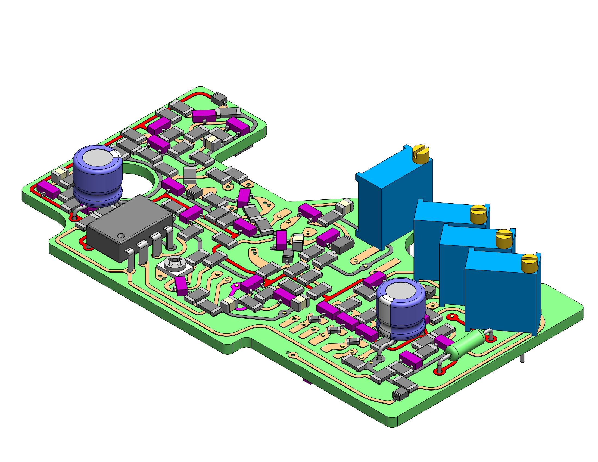
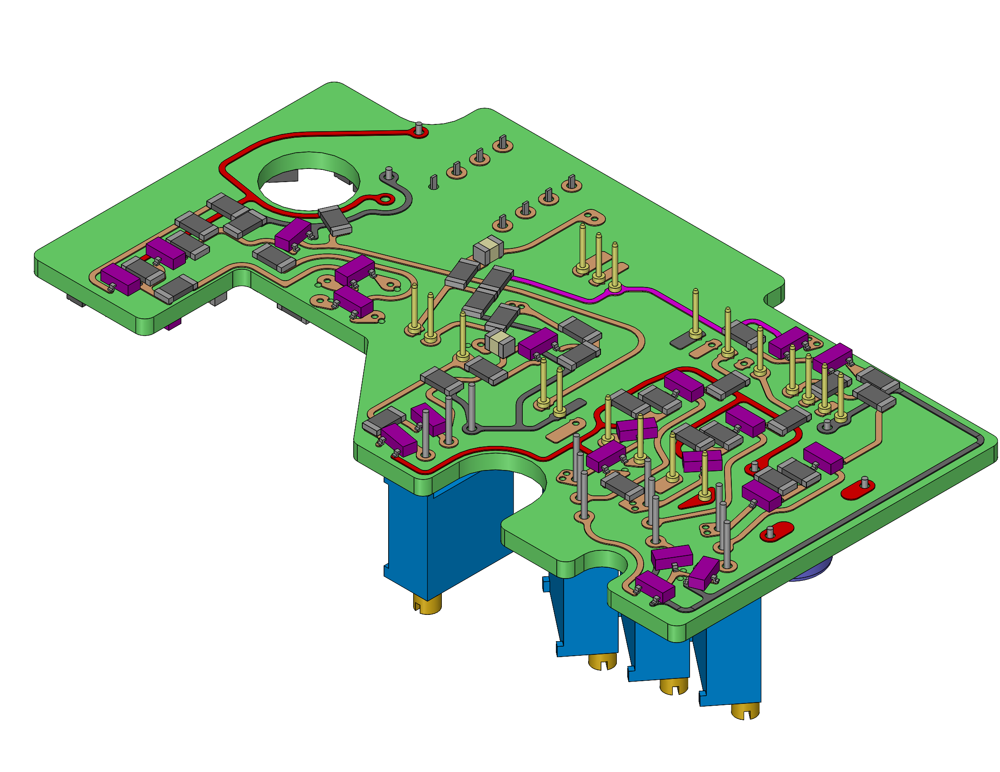
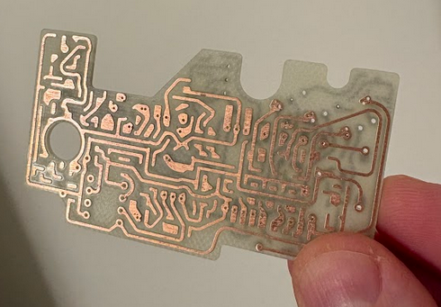
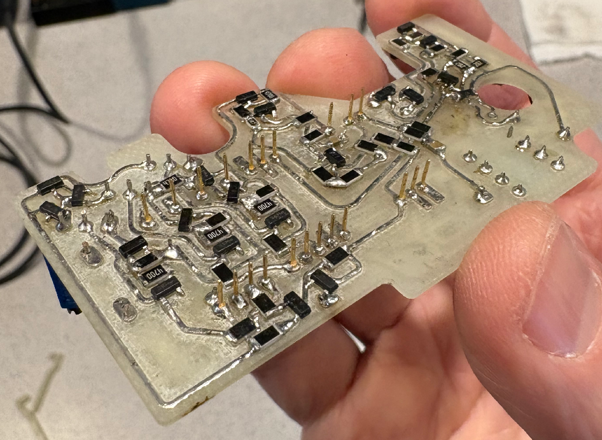

# Layout and Fabrication
 

 

 

 

 

 

 

 

 

## Parts List
 
As mentioned in another section, the part identifiers have evolved organically along with the circuit design. The ordering doesn't have much relationship to the circuit layout at this point.  
Many of the components, such as resistors are commoditity SMD parts, so no part number is given, just specs. The tolerances cover a range, because in many cases I used what I had on hand. The tolerance values given below will certainly work, but I would recommend using 1% fixed resistors whenever possible, as the cost is really quite negligible.  
There are some cases of 2 resistors in series being identified as 1 part. This is because they are needed for only one particular value, but are physically needed to jumper over multiple traces. This is just a consequence of my layout and fabrication limitations, and could be redesigned in a cleaner way. More about this will be discussed in later section.  
Some of the capacitors absolutely require C0G dielectric for temperature stability and voltage insensitivity, and this is noted in the "Notes" column where applicable.  
In some cases, multiple package sizes could fit, so I've noted that in the "Package Outline" column. In general, the pad layout is not optimal, agian, because of my fabrication limitations with a milled PCB. Some have more or less component lead overlap.  

| Part ID  | Part Number             | Value        | Package Outline      | Tolerance | Notes                         |
| -------- | ----------------------- | ------------ | -------------------- | --------- | ----------------------------- |
| C12      |                         | 10uF, 16V    | 0805                 |  +/- 10%  | X5R Dielectric                |
| Q10      | S8550                   | PNP          | SOT-23               |           |                               |
| R19      |                         | 2k           | 1206                 |  +/- 1%   | Thick film, 1/4W              |
| R61      |                         | 2k           | 1206                 |  +/- 1%   | Thick film, 1/4W              |
| R17      |                         | 2k           | 1206                 |  +/- 1%   | Thick film, 1/4W              |
| Q6       | S8050                   | NPN          | SOT-23               |           |                               |
| C3       |                         | 10uF, 16V    | 0805                 |  +/- 10%  | X5R Dielectric                |
| R36      |                         | 22k          | 1206                 |  +/- 5%   | Thick film, 1/4W              |
| R2       |                         | 1k           | 1206                 |  +/- 1%   | Thick film, 1/4W              |
| D1       | BZX384C3V3-E3-18        | 3.3V         | SOD-323              |  +/- 5%   | Zener                         |
| FUSE     |  0251.500MAT1L          | 500mA        | Through Hole         |           |                               |
| R9       |                         | 2k           | 1206                 |  +/- 1%   | Thick film, 1/4W              |
| R3       |                         | 3k           | 1206                 |  +/- 5%   | Thick film, 1/4W              |
| R18      |                         | 100k         | 1206                 |  +/- 5%   | Thick film, 1/4W              |
| C6       |                         | 0.1uF, 16V   | 0306 (or 0805)       |           | X5R Dielectric                |
| R20      |                         | 7.5K + 2K    | 1206                 |  +/- 1%   | Thick film, 1/4W, 2 in series |
| D3       | 1N4148W                 |              | SOD-123              |           |                               |
| Q27      | S8050                   | NPN          | SOT-23               |           |                               |
| R21      |                         | 4.7k         | 1206                 |  +/- 1%   | Thick film, 1/4W              |
| R4       |                         | 100k+50k     | 1206                 |  +/- 5%   | Thick film, 1/4W, 2 in series |
| Q3       | S8550                   | PNP          | SOT-23               |           |                               |
| C4       | GRM31C5C1E474JE01L      | 0.47uF, 25V  | 1206                 |  +/- 5%   | C0G Dielectric                |
| Q4       | FMMT449                 | NPN          | SOT-23               |           |                               |
| C5       | CL10A105KA8NNNL         | 1uF, 25V     | 0603                 |  +/- 10%  | X5R Dielectric                |
| Q10      | S8550                   | PNP          | SOT-23               |           |                               |
| R8       |                         | 2k           | 1206                 |  +/- 1%   | Thick film, 1/4W              |
| R5       |                         | 470          | 1206                 |  +/- 1%   | Thick film, 1/4W              |
| Q11      | S8050                   | NPN          | SOT-23               |           |                               |
| Q19      | S8550                   | PNP          | SOT-23               |           |                               |
| VRA_POT  | 3296W-1-202LF           | 2k           | 3296 – 3/8˝          |  +/- 10%  | Or similar                    |
| R75      |                         | 1k           | 1206                 |  +/- 1%   | Thick film, 1/4W              |
| Q5       | S8550                   | PNP          | SOT-23               |           |                               |
| R6       |                         | 470          | 1206                 |  +/- 1%   | Thick film, 1/4W              |
| LM1881   | LM1881                  |              | DIP-8                |           |                               |
| C2       |                         | 0.1uF, 16V   | 0306                 |           | X5R Dielectric                |
| R1       |                         | 200k         | 1206                 |  +/- 1%   | Thick film, 1/4W              |
| R26      |                         | 2k           | 1206                 |  +/- 1%   | Thick film, 1/4W              |
| R49      |                         | 1k           | 1206                 |  +/- 1%   | Thick film, 1/4W              |
| Q12      | S8050                   | NPN          | SOT-23               |           |                               |
| R25      |                         | 2k           | 1206                 |  +/- 1%   | Thick film, 1/4W              |
| D7       | BZX4C3V3-E3-18        | 3.3V         | SOD-323              |  +/- 5%   | Zener                         |
| D10      | BZX4C3V3-E3-18        | 3.3V         | SOD-323              |  +/- 5%   | Zener                         |
| R53      |                         | 10k          | 1206                 |  +/- 1%   | Thick film, 1/4W              |
| Q24      | S8050                   | NPN          | SOT-23               |           |                               |
| R54      |                         | 1k           | 1206                 |  +/- 1%   | Thick film, 1/4W              |
| C9       | CL21C102JCFNNNE         | 1nF, 100V    | 0805                 |  +/- 5%   | C0G Dielectric                |
| R52      |                         | 2k           | 1206                 |  +/- 1%   | Thick film, 1/4W              |
| D8       | BAT54H                  |              | SOD-323              |           | Schottky                      |
| R55      |                         | 10k          | 1206                 |  +/- 1%   | Thick film, 1/4W              |
| R59      |                         | 4.7k         | 1206                 |  +/- 1%   | Thick film, 1/4W              |
| R56      |                         | 2k           | 1206                 |  +/- 1%   | Thick film, 1/4W              |
| Q25      | S8050                   | NPN          | SOT-23               |           |                               |
| R57      |                         | 10k          | 1206                 |  +/- 1%   | Thick film, 1/4W              |
| R60      |                         | 2k           | 1206                 |  +/- 1%   | Thick film, 1/4W              |
| Q26      | S8550                   | PNP          | SOT-23               |           |                               |
| R58      |                         | 2k           | 1206                 |  +/- 1%   | Thick film, 1/4W              |
| C1       | ES5107M016AE1EA         | 100uF, 16V   |                      |  +/- 20%  | Electrolytic                  |
| D5       | BZX4C3V3-E3-18        | 3.3V         | SOD-323              |  +/- 5%   | Zener                         |
| R28      |                         | 2k           | 1206                 |  +/- 1%   | Thick film, 1/4W              |
| R29      |                         | 320          | 1206                 |  +/- 1%   | Thick film, 1/4W              |
| Q13      | S8550                   | PNP          | SOT-23               |           |                               |
| C7       | C0805C473K3GECAUTO7210  | 0.047uF, 25V | 0805                 |  +/- 10%  | C0G Dielectric                |
| R30      |                         | 2k           | 1206                 |  +/- 1%   | Thick film, 1/4W              |
| R50      |                         | 2k           | 1206                 |  +/- 1%   | Thick film, 1/4W              |
| Q14      | FMMT449                 | NPN          | SOT-23               |           |                               |
| R38      |                         | 470 + 0      | 1206                 |  +/- 1%   | Thick film, 1/4W, 2 in series |
| Q2       | S8050                   | NPN          | SOT-23               |           |                               |
| R31      |                         | 470          | 1206                 |  +/- 1%   | Thick film, 1/4W              |
| R27      |                         | 2k           | 1206                 |  +/- 1%   | Thick film, 1/4W              |
| R14      |                         | 10           | 1206                 |  +/- 1%   | Thick film, 1/4W              |
| D9       | BAT54H                  |              | SOD-323              |           | Schottky                      |
| R68      |                         | 10k          | 1206                 |  +/- 1%   | Thick film, 1/4W              |
| R69      |                         | 3k           | 1206                 |  +/- 5%   | Thick film, 1/4W              |
| Q23      | S8050                   | NPN          | SOT-23               |           |                               |
| R37      |                         | 2k           | 1206                 |  +/- 1%   | Thick film, 1/4W              |
| R62      |                         | 2k           | 1206                 |  +/- 1%   | Thick film, 1/4W              |
| R48      |                         | 2k           | 1206                 |  +/- 1%   | Thick film, 1/4W              |
| Q18      | S8550                   | PNP          | SOT-23               |           |                               |
| R32      |                         | 2k           | 1206                 |  +/- 1%   | Thick film, 1/4W              |
| Q16      | S8050                   | NPN          | SOT-23               |           |                               |
| R42      |                         | 470          | 1206                 |  +/- 1%   | Thick film, 1/4W              |
| Q20      | S8050                   | NPN          | SOT-23               |           |                               |
| R34      |                         | 4.7k         | 1206                 |  +/- 1%   | Thick film, 1/4W              |
| R43      |                         | 1k           | 1206                 |  +/- 1%   | Thick film, 1/4W              |
| R45      |                         | 10k          | 1206                 |  +/- 1%   | Thick film, 1/4W              |
| Q21      | S8550                   | PNP          | SOT-23               |           |                               |
| R44      |                         | 2k           | 1206                 |  +/- 1%   | Thick film, 1/4W              |
| Q17      | S8550                   | PNP          | SOT-23               |           |                               |
| R33      |                         | 2k           | 1206                 |  +/- 1%   | Thick film, 1/4W              |
| R47      |                         | 2k           | 1206                 |  +/- 1%   | Thick film, 1/4W              |
| R51      |                         | 2k           | 1206                 |  +/- 1%   | Thick film, 1/4W              |
| R46      |                         | 1k           | 1206                 |  +/- 1%   | Thick film, 1/4W              |
| Q22      | FMMT449                 | NPN          | SOT-23               |           |                               |
| R16      |                         | 1k           | 1206                 |  +/- 1%   | Thick film, 1/4W              |
| R39      |                         | 3k           | 1206                 |  +/- 5%   | Thick film, 1/4W              |
| Q15      | S8050                   | NPN          | SOT-23               |           |                               |
| R40      |                         | 2k           | 1206                 |  +/- 1%   | Thick film, 1/4W              |
| Q28      | S8050                   | NPN          | SOT-23               |           |                               |
| D11      | BZX384C3V3-E3-18        | 3.3V         | SOD-323              |  +/- 5%   | Zener                         |
| R76      |                         | 2k           | 1206                 |  +/- 1%   | Thick film, 1/4W              |
| C8       | ES5107M016AE1EA         | 100uF, 16V   |                      |  +/- 20%  | Electrolytic                  |
| R10      |                         | 22k          | 1206                 |  +/- 5%   | Thick film, 1/4W              |
| R35      |                         | 10           | 1206                 |  +/- 1%   | Thick film, 1/4W              |
| R65      |                         | 22k          | 1206                 |  +/- 5%   | Thick film, 1/4W              |
| Q29      | S8550                   | PNP          | SOT-23               |           |                               |
| Q33      | S8550                   | PNP          | SOT-23               |           |                               |
| Q34      | S8550                   | PNP          | SOT-23               |           |                               |
| R11      |                         | 22k          | 0603 (or 0805)       |  +/- 5%   | Thick film, 1/4W              |
| R12      |                         | 200          | 1206                 |  +/- 5%   | Thick film, 1/4W              |
| R15      |                         | 4.7k         | 1206                 |  +/- 1%   | Thick film, 1/4W              |
| R13      |                         | 470          | 1206                 |  +/- 1%   | Thick film, 1/4W              |
| Q7       | MMBTH10L                | NPN          | SOT-23               |           |                               |
| Q8       | MMBTH81                 | PNP          | SOT-23               |           |                               |
| GG_POT   | 3296W-1-202LF           | 2k           | 3296 – 3/8˝          |  +/- 10%  | Or similar                    |
| RG_POT   | 3296W-1-202LF           | 2k           | 3296 – 3/8˝          |  +/- 10%  | Or similar                    |
| BG_POT   | 3296W-1-202LF           | 2k           | 3296 – 3/8˝          |  +/- 10%  | Or similar                    |
| J1       | SMMBFJ177LT1G           | P-Channel    | SOT-23               |           |                               |
| J2       | SMMBFJ177LT1G           | P-Channel    | SOT-23               |           |                               |
| J3       | SMMBFJ177LT1G           | P-Channel    | SOT-23               |           |                               |
| R23      |                         | 470          | 1206                 |  +/- 1%   | Thick film, 1/4W              |
| Q31      | MMBTH10L                | NPN          | SOT-23               |           |                               |
| D2       | BAT54H                  |              | SOD-323              |           | Schottky                      |
| D4       | BAT54H                  |              | SOD-323              |           | Schottky                      |
| D6       | BAT54H                  |              | SOD-323              |           | Schottky                      |
| R74      |                         | 22k          | 1206                 |  +/- 5%   | Thick film, 1/4W              |
| Q32      | S8050                   | NPN          | SOT-23               |           |                               |
| R73      |                         | 2k           | 1206                 |  +/- 1%   | Thick film, 1/4W              |
| R72      |                         | 22k          | 1206                 |  +/- 5%   | Thick film, 1/4W              |
| Q9       | S8050                   | NPN          | SOT-23               |           |                               |
| R24      |                         | 2k           | 1206                 |  +/- 1%   | Thick film, 1/4W              |
| R71      |                         | 10k          | 1206                 |  +/- 1%   | Thick film, 1/4W              |
| R64      |                         | 10k          | 1206                 |  +/- 1%   | Thick film, 1/4W              |
| R63      |                         | 2k           | 1206                 |  +/- 1%   | Thick film, 1/4W              |
| R67      |                         | 330          | 1206                 |  +/- 1%   | Thick film, 1/4W              |
| Q30      | S8050                   | NPN          | SOT-23               |           |                               |
| R66      |                         | 330          | 1206                 |  +/- 1%   | Thick film, 1/4W              |
| SKEW_POT | TC33X-2-202E            | 2k           | TC33 – 3 mm          |  +/- 25%  |                               |
| C11      |                         | 2uF, 25V     | 0603                 |           | X5R Dielectric                |
| R70      |                         | 47k          | 1206                 |  +/- 1%   | Thick film, 1/4W              |
|          |                         |              |                      |           |                               |
| SOCKET   | 317-87-121-41-005101    |              | 21 Pos, 1.78mm pitch |           | x2                            |
| PIN      | 3121-2-00-15-00-00-08-0 |              | 0.017" Diameter      |           | x22                           |

  

## Fabrication Details:
* My skills with tools like KiCad are pretty much non-existent at the moment. But due to my background and skills, I'm pretty comfortable designing PCBs with CAD tools and fabricating them by way of CNC milling, which is what I've done in this case. There are some obvious limitations, as these CAD tools are mainly for mechanical design. Traces and components have to be designed at a very low-level in terms of explicit geometry, as well as in terms of machinable features. As such, I've limited trace spacing to about 0.8mm, though I ultimately machined the latest design using a 0.6mm tool. This means that pad spacing isn't always ideal, with some components having very little overlap between pad and lead. But they certainly can be soldered by hand to achieve a reliable solder joint, it just takes a little patience to properly place the parts. I'd really like to do a proper layout at some point, which would enable professional fabrication with smaller trace spacing, smaller components, etc., but it will take time to learn the tools.  
* I've designed for 1/16" thick, dual copper clad PCB stock. I believe what I've used is 1 oz. copper, but I'm not entirely sure. In any case, this should be adequate for trace conductance. The Mill-Max pins, as well as the other through-hole components work well with this board thickness.  
* All of the holes for the Mill-Max pins were designed for 0.55mm drills. I've tried to maximize the trace/pad size for the pins in most cases for maximum pin retention, so there is copper on both sides that they should be soldered to. In many cases, the pin itself serves as via to make a connection between both sides of the board. Not all of the 42 pins of the original XC1186B footprint are utilized, as some of these simply connect to discrete components on the AB that I'm not using in my design. There are also sections that I haven't fully implemented, like horiztonal deflection shutdown for X-ray protection, making use of Pin 30. In cases like this, I've placed holes and pads for the pin (which can be populated for extra retention in the socket), but currently have no circuit function. This could make rework easier in the future, if I or someone else want to attempt the prototyping of design changes.  
* The Mill-Max pins on the board could be directly soldered to the Color Classic's analog board after the XC1186B is desoldered an removed, but I highly recommend using a socketed connection instead. This will make debugging and rework much easier. In the parts list above, I've specified the 317-87-121-41-005101 socket, of which two are needed for the two rows of 21 pins locations. These use the correct 1.78mm pitch of the XC1186B, and their pin diameters are compatible with the AB's through holes.  
* You may also notice other 0.55mm holes in the layout, usually in close pairs. This is how I've been doing vias for manually assembled board. A small piece of wire looped through both holes, twisted, soldered, and then cut close to the board makes for a reliable connection that won't fall out if the solder is subsequently reflowed. These particular via locations, requiring an additional discrete wire loop, are identified in a graphic above.  
* Some of the through-hole components are also intended to serve as via connections, so they should be soldered to the corresponding copper on both sides. This is true for components like electrolytic capacitors that have longer leads and the component itself does not rest directly on the board. In the case of the Bourns trim pots, these are intended to sit flush against the top side of the board, making soldering on that side impractical. In this case, I've not attempted to make a via connection using the pot's leads, but there are some neighboring vias using the dual-hole technique mentioned above.  
* I highly recommend tinning all the traces with solder prior to component assembly. This helps to prevent copper corrosion over time.  
* Some regions of the circuitry involve fairly high impedances, especially in the RGB pre-amp section. As such, even small current leakage from flux residue can reduce performance. It's important to wash away all flux residue after PCB assembly. The same applies the analog board after desoldering the XC1186B.  
 

[Top PCB Outline and Trace DXF](https://github.com/jonschultz/colorclassic_video_processor/blob/main/video_integrated_PCB3_top_simplified.dxf)
 
[Bottom PCB Outline and Trace DXF](https://github.com/jonschultz/colorclassic_video_processor/blob/main/video_integrated_PCB3_bottom_simplified.dxf)
