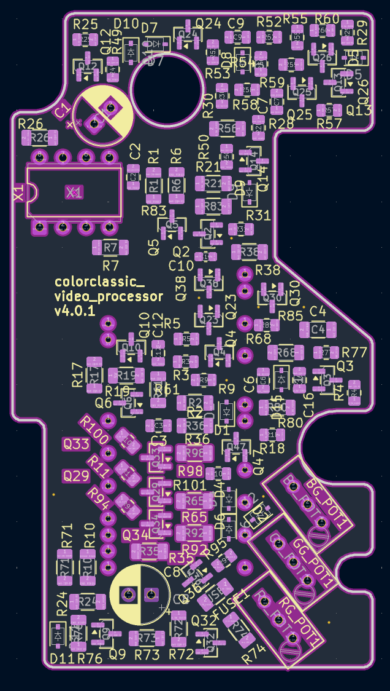
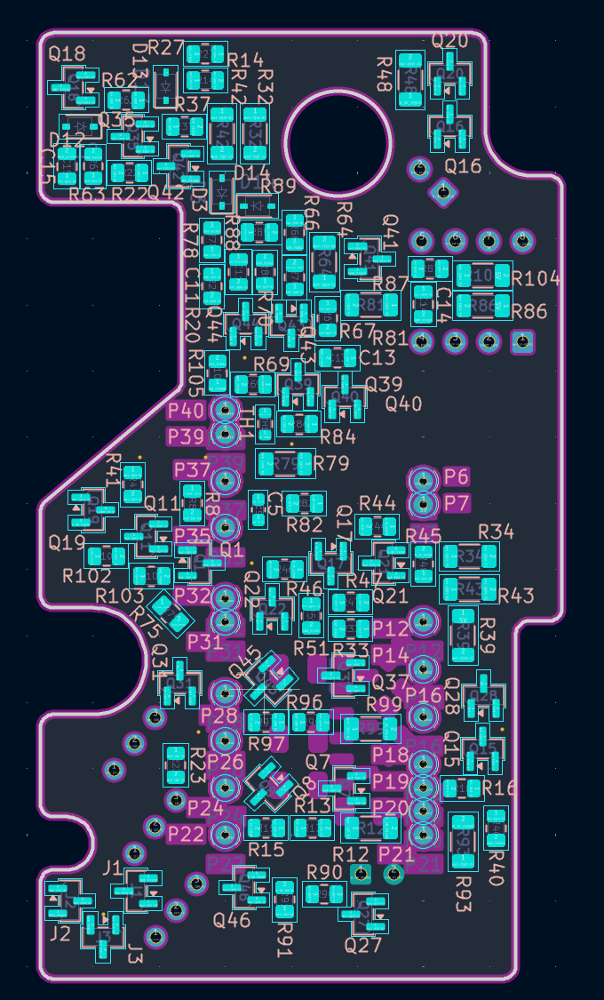
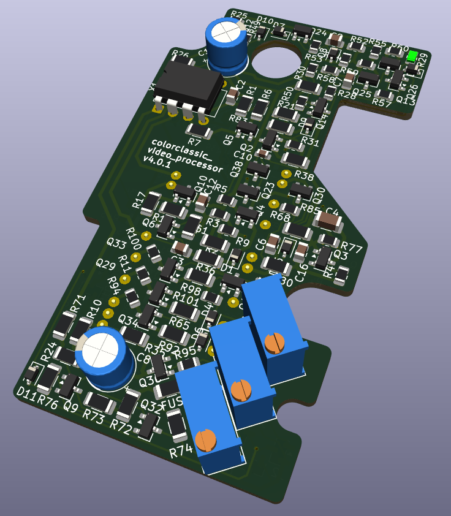

# Layout and Fabrication
 

 

 

   

## Parts List
 
As mentioned in another section, the part identifiers have evolved organically along with the circuit design. The ordering doesn't have much relationship to the circuit layout at this point.  
Many of the components, such as resistors are commoditity SMD parts, so no part number is given, just specs. I would recommend using 1% fixed resistors whenever possible, as the cost is really quite negligible.  
Some of the capacitors absolutely require C0G dielectric for temperature stability and voltage insensitivity. A part number is explicity called out for all the capacitors. Other similar parts should work, as long C0G dielectric is used where specified.  
The BOM is too long to provide in a table on this page, so I've provided a CSV file here: 

[BOM](https://github.com/jonschultz/colorclassic_video_processor/blob/main/ccvp_v4.0.1.csv)
 

  

## Fabrication Details:
* Not all of the 42 pins of the original XC1186B footprint are utilized, as some of these simply connect to discrete components on the AB that I'm not using in my design. There are also sections that I haven't fully implemented, like horiztonal deflection shutdown for X-ray protection, making use of Pin 30.  
* The Mill-Max pins on the board could be directly soldered to the Color Classic's analog board after the XC1186B is desoldered an removed, but I highly recommend using a socketed connection instead. This will make debugging and rework much easier. I used two of the Preci-dip 317-87-121-41-005101 sockets, which are needed for the two rows of 21 pins locations. These use the correct 1.78mm pitch of the XC1186B, and their pin diameters are compatible with the AB's through holes.  
* Some regions of the circuitry involve fairly high impedances, especially in the RGB pre-amp section. As such, even small current leakage from flux residue can reduce performance. It's important to wash away all flux residue after PCB assembly, if you are doing your own hand-assembly. The same applies the analog board after desoldering the XC1186B.  
* I've provided a zip file with the fabrication files (Gerbers and drill files) for v4.0.1, which can be directly uploaded to a PCB fab house like PCBWay. I've also provided a zipped archived set of KiCad design files. Everything here is provided under a Creative Commons license, allowing anyone to reuse/remix this work for non-commercial purposes. 
<a href="https://github.com/jonschultz/colorclassic_video_processor/">colorclassic_video_processor</a> © 2026 by <a href="https://github.com/jonschultz/colorclassic_video_processor/">Jonathan Schultz</a> is licensed under <a href="https://creativecommons.org/licenses/by-nc-sa/4.0/">CC BY-NC-SA 4.0</a>

[KiCad Design Files](https://github.com/jonschultz/colorclassic_video_processor/blob/main/ccvp_v4.0.1.zip)
 
[Gerber Files](https://github.com/jonschultz/colorclassic_video_processor/blob/main/ccvp_v4.0.1_gerber.zip)
