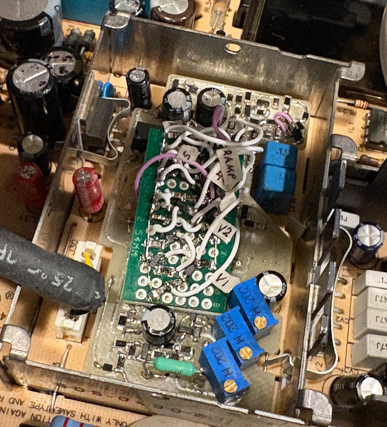

# Future and Ongoing Work
* Development for colorclassic_video_processor was performed almost exclusively at 640x480 resolution at 60Hz refresh using the VGA mod on my Mystic-upgraded CC. Very little testing has been done at other resolutions, though I know it can produce a raster at 800x600, albeit with a lot of geometry issues. If there is interest in high-res, I might try to improve the support. On the low-resolution end, ~I don't see why the CC's native 512x384 wouldn't work, though I do anticipate it would at least require adjustment of the horizontal shift. A centered raster at 512x384 might even be out of range of the Horizontal Shift pot, but it could certainly be "recentered" with a simple resistor change.~ (I've done some testing 512x384 since first writing this, and there are definitely some timing issues that need to be resolved) Even so, I would like to have better support for 512x384 right out of the box, requiring little adjustment or PCB rework on the part of the user to get good raster geometry. I would anctipate centering issues with the current design because of the way the horizontal drive pulse is timed relative to the horizontal sync pulse. Right now, this is done by using the previous scan line's horizontal sync pulse, with a nominal delay of about 28 microseconds (adjustable by way of the Horizontal Shift pot). This value is fundamentally related to the 31.5kHz horizontal frequency for 640x480. As such, it would be more appropriate to synchronize to the current scan line's horizontal sync pulse and introduce the appropriate associated phase delay, but the horizontal drive pulse actually needs to occur earlier in time, by about 3.5 microseconds. This value is (mostly) independent of the horizontal frequency, making any method that utilizes syncronization in this direction far more resolution-agnostic, but it's obviously trickier because the system has to predict when the horizontal sync pulse will occur. I expect that the XC1186B does this by way of an internal PLL, but I don't know for sure. In my timing circuitry, it could be done another way, and I've already started prototyping this method with promising results. The changes could end up being fairly minor and straightforward. The results won't really change much for 640x480, but I'm still excited that this would enable synchronization the "right" way. As far as vertical deflection goes, anything other than 60Hz will definitely require an adjustment of the "VRA" pot to bring the size within range of the full screen height. At the 56Hz refresh rate of 800x600 on a Mystic machine, the image is very stretched using the same settings as for 640x480. This is because the ramp rate is fairly fixed, with minor adjustment provided by the AB's "VH" pot. I would like to explore design changes that would automatically scale the ramp rate based on the vertical frequency, eliminating the need for VRA adjustment when switching between resolutions. More to come on this later...  
* Use of the TDA8145's output to correct the warp artifact has been very effective, but it's is obviously somewhat unsatisfying to introduce a bodge to route a signal that the XC1186B doesn't need. For better drop-in compatibility I would like to be able to correct the distortion using the flyback pulse for feedback. This gives a true measure of the timing offset between the horizontal drive pulse and the actual horizontal deflection current. This is another function that I expect the XC1186B handles with some kind of feedback loop. I have some ideas for an implementation in my circuitry, but it's far from straightforward. The flyback pulse presented to the XC1186B footprint is a pretty "dirty" signal and the output impedance is high. Just deriving a timing edge from it has been somewhat painful. But I am working on this, and hopefully there will be some progress in the coming weeks.  
* In the spirit of providing more drop-in compatibility, if there is any outside interest in enabling the Blue Gain and Green Gain pots on the analog board (the only two that are currently non-functional with colorclassic_video_processor) I might work to implement it. I doubt that I would eliminate the gain pots that are on-board, since I personally think this is an upgrade due to the large dynamic range and 3-channel independent control. More likely, I would enable the Blue Gain and Green Gain pots to provide a little bit of fine control, in parallel with the full-range control of the onboard pots, similar to I've implemented Sub Contrast.  
* More related to board fabrication, I would definitely like to get started with KiCad to do a proper PCBA layout, and then provide all the design and output files so anyone can have it fabbed. I'm starting from scratch in this area, but I'm highly motivated to learn. PCB milling can be a fun and rapid method of making boards at home, and I've done it a lot, but there are obvious limitations. Time for something new.  

## Current Development Status
* As of 5/26/2026, I've been experimenting with design changes and rework of the published v3 design to change the horizontal drive timing architecture. I have it basically working with timing referenced to the current scanline's HSYNC pulse, while also controlling the duty cycle more accurately. This makes the system much more tolerant of changes to the horizontal frequency, enabling 512x384, 640x480, and 800x600, with only some adjustment of the Horizontal Shift ("HS") potentiometer.  
* 6/6/2026 - I've prototyped changes to the horizontal circuitry on v3 to measure and regulate the phase of the horizontal drive pulse relative to the flyback pulse, providing PLL-like functionality. This goes beyond even the function mentioned above, removing many of the horizontal shift drift effect. It also makes the system even more agnostic to various resolutions and associated horizontal frequencies, and eliminates the need for a signal from the TDA8145 for "warp compensation". I'm working on more testing and optimization. I hope to have a v4 layout done in the next couple of weeks.  

 
