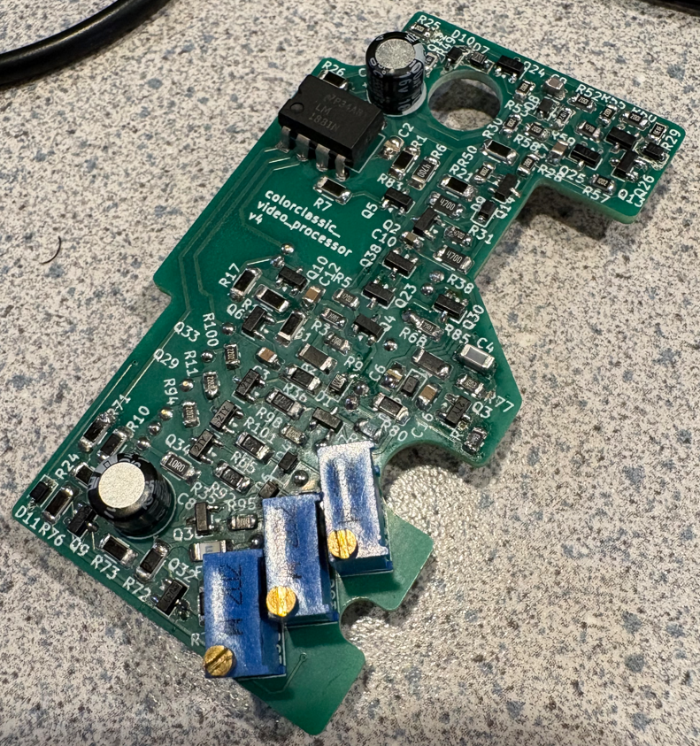
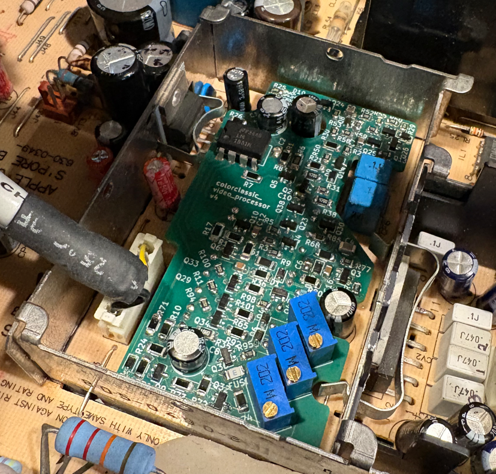
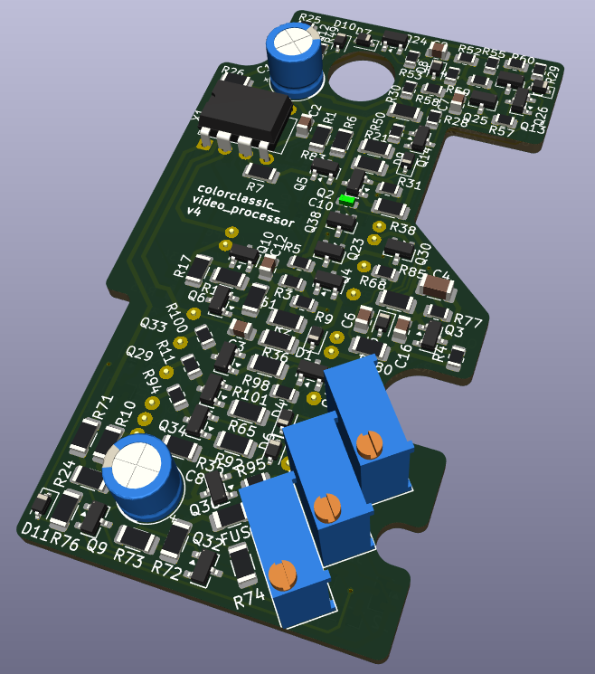
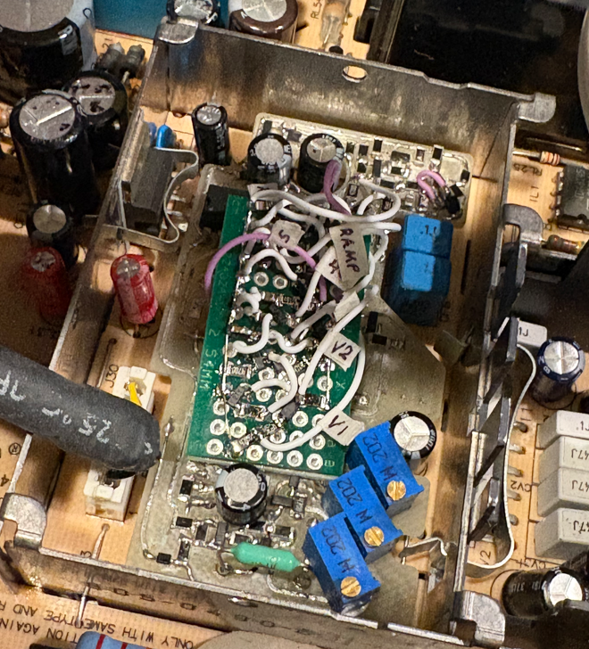

# Future and Ongoing Work
* In the spirit of providing more drop-in compatibility, if there is any outside interest in enabling the Blue Gain and Green Gain pots on the analog board (the only two that are currently non-functional with colorclassic_video_processor) I might work to implement it. I doubt that I would eliminate the gain pots that are on-board, since I personally think this is an upgrade due to the large dynamic range and 3-channel independent control. More likely, I would enable the Blue Gain and Green Gain pots to provide a little bit of fine control, in parallel with the full-range control of the onboard pots, similar to I've implemented Sub Contrast.  

## Development Status History
* 7/26/2026 - Version 4.0.1 design released publicly.  
* 7/21/2026 - I've received the v4 PCBs from the fab, and I've got one assembled and running. Performance looks good and prety much identical to the reworked v3 prototype. However, I've already made some small changes to a few component values and some other minor changes in the horizontal section for further reduced temperature sensitivity. I plan to package up the KiCad files, BOM, and Gerbers + drill files for v4.0.1 and post them within the next few days. This will also mean that I'll need to clean up all the other sections of the repo to reflect the latest design. It's a lot of work, but it's coming.  
  
  
* 7/3/2026 - Completed porting the v4 design to KiCad, and now in the process of getting PCBs made externally. After initial assembly and testing, I plan to update all the documentation and post output files for v4, including Gerbers for PCB fabrication. v4 features will include:  
    * Better support for various resolutions and timings by normalizing horizontal and vertical adjustment ranges accordingly. 
    * PLL-like horizontal timing synchronization for reduced drift and horizontal shift effects across a frame (such as due to pincushion correction). Eliminates the need for a special connection to the TDA8145. 
    * Eliminates the additional coarse vertical adjusment potentiometer. 
    * Cleaner routing using standard PCBA design rules.  
  
* 6/27/2026 - v4 design is complete and I'm in the process of converting the project over to KiCad. The next design and output files that I post here will hopefully be output files from KiCad for easy PCBA fabrication.  
* 6/20/2026 - Further improvements to the phase correction in the horizontal circuitry have been prototyped and are working well. It has improved capability to detect the horizontal frequency and scale certain signals accordingly, requiring even less adjustment when switching resolutions. I've also implemented similar scaling in the vertical circuitry, though there's still some work to be done there for v4.  
 
v3 PCBA with rework and additional proto-board to experiment with v4 changes.  
* 6/6/2026 - I've prototyped changes to the horizontal circuitry on v3 to measure and regulate the phase of the horizontal drive pulse relative to the flyback pulse, providing PLL-like functionality. This goes beyond even the function mentioned above, removing many of the horizontal shift drift effects. It also makes the system even more agnostic to various resolutions and associated horizontal frequencies, and eliminates the need for a signal from the TDA8145 for "warp compensation". I'm working on more testing and optimization. I hope to have a v4 layout done in the next couple of weeks.  
* As of 5/26/2026, I've been experimenting with design changes and rework of the published v3 design to change the horizontal drive timing architecture. I have it basically working with timing referenced to the current scanline's HSYNC pulse, while also controlling the duty cycle more accurately. This makes the system much more tolerant of changes to the horizontal frequency, enabling 512x384, 640x480, and 800x600, with only some adjustment of the Horizontal Shift ("HS") potentiometer.  

