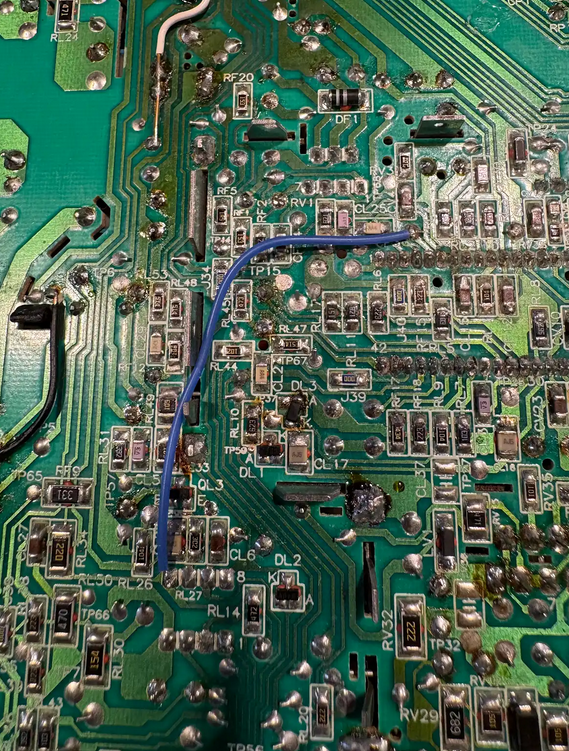

# Installation and Setup
 

## Preparing the Board
* After PCBA assembly, it's a good idea to set the potentiometers to rough nominal positions to get a good image, prior to installation and first startup. Experimentally, I've found that setting the blue and green gain trim pots so that the low side to wiper resistance is about 600 ohms is a good starting point. For red, this is around 450 ohms. These values can be measured in-circuit (no need to do it prior to soldering the pots onto the board) as the adjustment is made. As will be discussed below, the RGB gain adjustments can also be done live when the system is running.  
* The warp (SKEW_POT) adjustment can also be made prior to adjustment, though it might take some trial and error to set it correctly once the system is running, as will be discussed below.  
* See the Fabrication section for details on installing sockets into the analog board. I'll assume here that this has been completed.  
* In order to fully utilize the de-warping compensation with SKEW_POT, a single bodge wire is required to connect from the Pin 5 position on the analog board to pin 5 of the TDA8145. This can be done easily on the underside of the analog board, with the bottom video cage cover removed. See the image below for the required bodge connection. Without this mod, colorclassic_video_processor will still function perfectly fine, but there will be a minor geometry artifact resulting in a slightly bowed image that can't be corrected with the standard geometry adjustments on the back of the analog board.  

  
* One other detail related to preparation of the analog board is that film capacitors CF4 and CL36 (see the image below) either need to be removed or bent over. These caps will otherwise interfere with the colorclassic_video_processor board, and working around them with a reduced board outline would have been too constraining. These caps serve no purpose with the XC1186B removed, so there's no harm in bending them or fully removing them. I've simply bent mine over in case I ever need them in the future.  

  
* When installing the PCBA in the sockets, press firmly on all sides of the board, trying to keep it relatively level at all times. Of course, be careful not to apply too much force locally to any single component.  

## Startup
* When running the system for the first few times, it's convenient to run without the top of the video cage re-installed. This way, the PCBA can be pulled in and out if necessary, and the trim pots can be adjusted. There might be a very slight but noticeable vertical artifact line in the image in this state (corresponding to the negative edge of the horizontal drive pulse), but this will disappear with the cage top applied. Once all adjustments are completed and board works satisfactorily, I recommend replacing the top of the cage (as well as the bottom cover on the underside of the analog board, if it has not already been replaced).  
* As mentioned earlier, the RGB gain pots are located in a rear corner so that they're maximally accessible with the analog board fully installed, even with the system powered on. Adjustments can be made live to optimize the color balance to one's preference. Of course, always be careful when operating close to live CRT components.  

  
* The VRA_POT (vertical ramp amplifier) should be set nominally so that low-side to high-side resistance ratio is about 1:3, for a gain of 4x. If you install the same 2k trim pot as in the RGB positions, this means about 500 ohms on the low side of the pot. Keep in mind that this is a coarse, very wide dynamic range adjustment for the height of the vertical raster. The "VH" control on the rear of the analog board serves as a fine tuning control, and will still function, just as with the XC1186B. My original intention for designing this control was to accommodate various part tolerances. But with better design that evolved over time and more tightly spec'ed components, I'm not sure it's really needed. I've left a spot for the pot on the board, but in practice I've been able to solder fixed 1k and 3k resistors (maintaing the same 1:3 resistance ratio, total resistance is not as critical) using the through-hole pads on the bottom side of the board, and that gets it close enough. In any case, the VRA_POT is just barely accessible with the board installed and the system running, so one can make live adjustments if necessary.  
* The warp (SKEW_POT) adjuster is a much smaller, and harder-to-access SMD component near the front side of the board. It's not readily adjustable with the analog board fully installed and the system powered. I would recommend depowering the machine, disconnecting the neck board from the CRT, disconnecting the speaker cable, and then sliding the analog board back by a few inches to gain better access. Small, iterative adjustments can be made to the pot, checking the image geometry each time after re-installation of the analog board. Typically, the pot will require some rotation counter clockwise from the middle wiper position to null the associated artifact. An image of the position that I'm currently using is shown below. In the middle position (effectively disabling the de-warping compensation), the left side of the image will be slightly bowed in at the vertical center, and right side will be oppositely bowed outward. In the optimal adjustement position, the two side should look as vertical as possible.  
  

  
Non-corrected image. Notice the concave warp on the left side of the image.  
  

  
With optimal adjustment of the SKEW_POT.  
  

  
A good rough position to start with on the SKEW_POT.  
