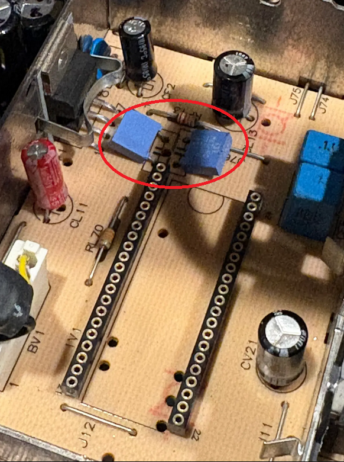
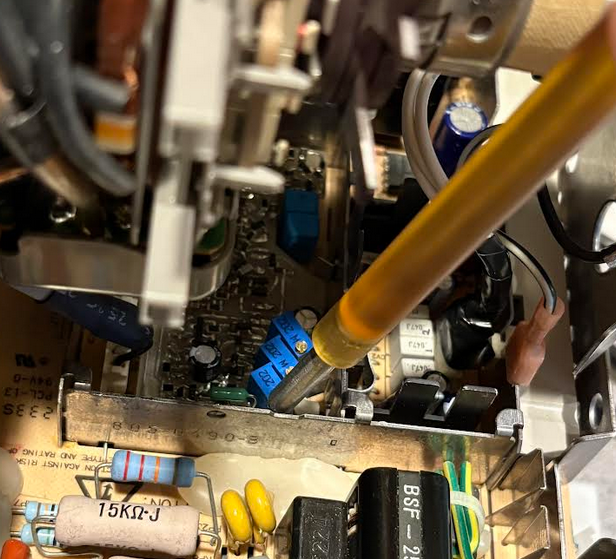
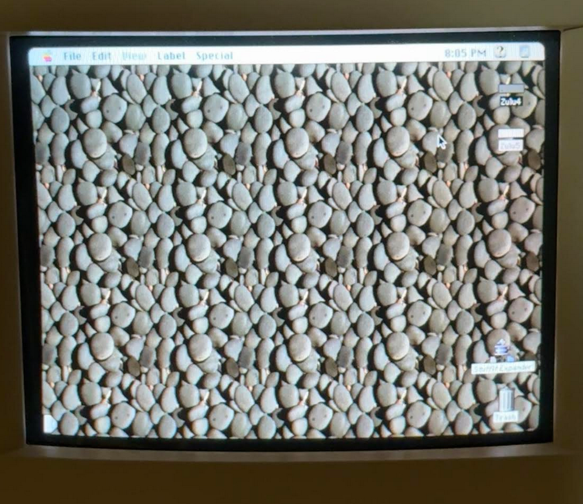
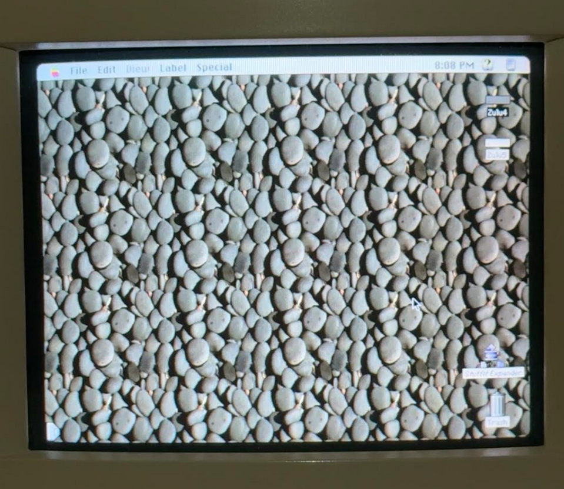
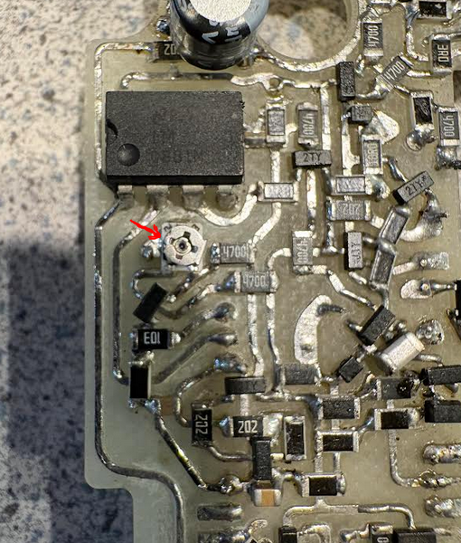

# Installation and Setup
 

## Preparing the Board
* After PCBA assembly, it's a good idea to set the potentiometers to rough nominal positions to get a good image, prior to installation and first startup. Experimentally, I've found that setting the blue and green gain trim pots so that the low side to wiper resistance is about 600 ohms is a good starting point. For red, this is around 450 ohms. These values can be measured in-circuit (no need to do it prior to soldering the pots onto the board) as the adjustment is made. As will be discussed below, the RGB gain adjustments can also be done live when the system is running.  
* The warp (SKEW_POT) adjustment can also be made prior to adjustment, though it might take some trial and error to set it correctly once the system is running, as will be discussed below.  
* See the Fabrication section for details on installing sockets into the analog board. I'll assume here that this has been completed.  
* One other detail related to preparation of the analog board is that film capacitors CF4 and CL36 (see the image below) either need to be removed or bend off. These caps will otherwise interfere with the colorclassic_video_processor board, and working around them with a reduced board outline would have been too constraining. These caps serve no purpose with the XC1186B removed, so there's no hard in bending them or fully removing them. I've simply bent mine over, in case I ever need them in the future.  

 
* When installing the PCBA in the sockets, press firmly on all sides of the board, trying to keep it relatively level at all times. Of course, be careful not to apply too much force locally to any single component.  

## Startup
* When running the system for the first few times, it's convenient to run without the top of the video re-installed. This way, the PCBA can be pulled in and out if necessary, and the trim pots can be adjusted. There might be a very slight but noticeable vertical artifact line in the image in this state, but this will disappear with the cage top applied.  
* As mentioned earlier, the RGB gain pots are located in a rear corner so that they're maximally accessible with the analog board fully installed, and with the system powered on. Adjustments can be made live to optimize the color balance to one's preference. Of course, always be careful when operating close to live CRT components.  

 
* The warp (SKEW_POT) adjuster is a much smaller, and harder-to-access SMD component near the front side of the board. It's not readily adjustable with the analog board fully installed and the system powered. I would recommend depowering the machine, disconnecting the neck board from the CRT, disconnecting the speaker cable, and then sliding the analog board back by a few inches to gain better access. Small, iterative adjustments can be made to the pot, checking the image geometry each time after re-installation of the analog board. Typically, the pot will require some rotation counter clockwise from the middle wiper position to null the associated artifact. An image of the position that I'm currently using is shown below. In the middle position (effectively disabling the de-warping compensation), the left side of the image will be slightly bowed in at the vertical center, and right side will be oppositely bowed outward. In the optimal adjustement position, the two side should look as vertical as possible.  
 

 
Non-corrected image. Notice the concave warp on the left side of the image.  

 
With optimal adjustment of the SKEW_POT.  

 
A good rough position to start with on the SKEW_POT.  
