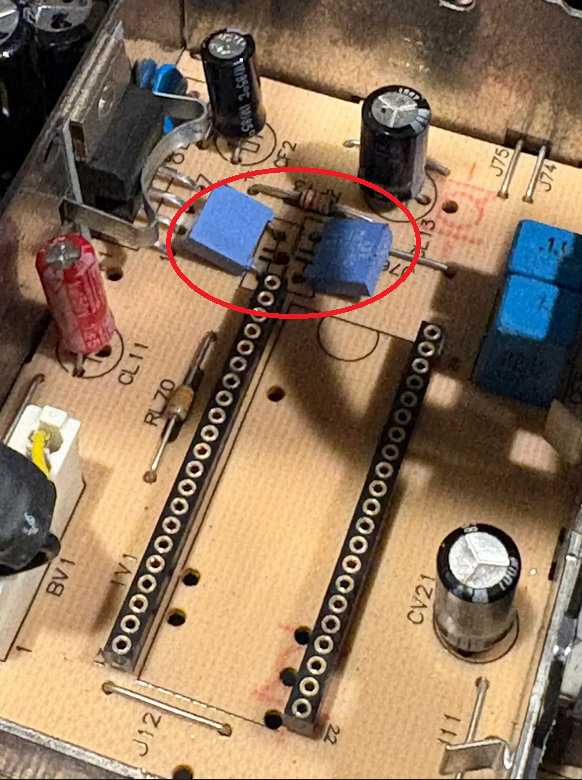
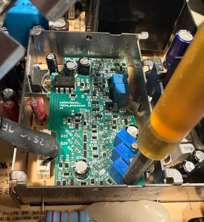

# Installation and Setup
 

## Preparing the Board
* After PCBA assembly, it's a good idea to set the potentiometers to rough nominal positions to get a good image, prior to installation and first startup. Experimentally, I've found that setting the blue and green gain trim pots so that the low side to wiper resistance is about 600 ohms is a good starting point. For red, this is around 450 ohms. These values can be measured in-circuit (no need to do it prior to soldering the pots onto the board) as the adjustment is made. As will be discussed below, the RGB gain adjustments can also be done live when the system is running.  
* See the Fabrication section for details on installing sockets into the analog board. I'll assume here that this has been completed.  
* One other detail related to preparation of the analog board is that film capacitors CF4 and CL36 (see the image below) either need to be removed or bent over. These caps will otherwise interfere with the colorclassic_video_processor board, and working around them with a reduced board outline would have been too constraining. These caps serve no purpose with the XC1186B removed, so there's no harm in bending them or fully removing them. I've simply bent mine over in case I ever need them in the future.  

  
* When installing the PCBA in the sockets, press firmly on all sides of the board, trying to keep it relatively level at all times. Of course, be careful not to apply too much force locally to any single component.  

## Startup
* When running the system for the first few times, it's convenient to run without the top of the video cage re-installed. This way, the PCBA can be pulled in and out if necessary, and the trim pots can be adjusted. There might be a very slight but noticeable vertical artifact line in the image in this state (corresponding to the negative edge of the horizontal drive pulse), but this will disappear with the cage top applied. Once all adjustments are completed and board works satisfactorily, I recommend replacing the top of the cage (as well as the bottom cover on the underside of the analog board, if it has not already been replaced).  
* As mentioned earlier, the RGB gain pots are located in a rear corner so that they're maximally accessible with the analog board fully installed, even with the system powered on. Adjustments can be made live to optimize the color balance to one's preference. Of course, always be careful when operating close to live CRT components.  

  
