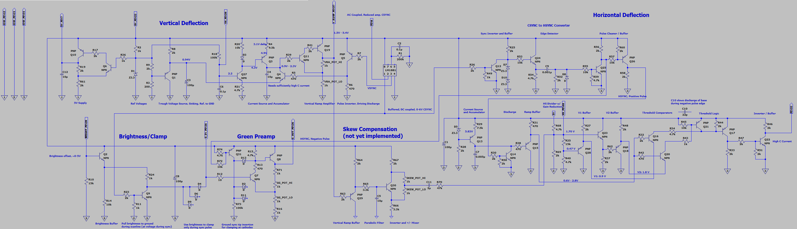

#
Horizontal Section
 
The high-level function of the horizontal section is to take the composite sync signal provided on the Color Classic analog board ("AB"), extract a horizontal sync signal, and then use that to generate the horizontal deflection pulse within the required range of duty cycle. The horizontal deflection pulse is used to ultimately pulse the horizontal output transistor on the AB.
 
Signal Chain:
  
#1 The LM1881 IC is used to provide a DC-coupled, approx 0-6V composite sync ("CSYNC") signal, using the AB's AC-coupled CSYNC singal as input. The LM1881 provides other functions that will be described in later sections. But here, the "copy" of the CSYNC signal is useful as a low-ouptut impedance input to the horizontal circuitry. The CSYNC falling edge represents the start of a scanline. 
#2 CSYNC pulls a simple voltage regulator of two 3.3V Zener diodes to ground when high with a BJT inverter, conversely producing 6.6V at the falling edge. 
#3 The 6.6V pulse is buffered and drives a simple edge detector comprised of an RC network. An quickly decaying exponential pulse results (about 1μs in duration), independent of the duty cycle of the CSYNC input. This allows the circuity to generate all pulses nearly equally in amplitude and duration, whether the input pulse is at the start of the scanline or during the vertical sync period when the duty cycle is larger. 
#4 Two BJTs are used to "clean" and buffer the pulse into a more digital signal. In effect, this generates a horizontal sync ("HSYNC") signal. 
#5 Independently, a BJT current source (referenced to the 8V rail) linearly charges a 5nF accumulator capacitor to produce a linear voltage ramp. 
#6 The HSYNC pulse is then used to reset the accumulator to ground potential at the horizontal frequency at the start of every scanline. The resulting sawtooth waveform is buffered by a PNP BJT, with an output voltage between 0.6V and 2.8V. 
#7 Two reference voltage ("V1" and "V2") are generated with BJT voltage followers (with different levels of buffering), using a simple resistive voltage divider as the input referece. The divider uses Pin 40 (the "horizontal shift") signal as input, with a gain reduction forced by another voltage divider with input from the 5V rail (described in a later section). The nominal voltage generated by this gain-reducing divider, and Pin 40 itself, is 1.7V, which is the approximate voltage buffered by the downstream V2 source. 
#8 Two BJTs serve as comparators between the sawtooth waveform and the V1 and V2 reference voltages. Their collectors pull low to their reference voltages as the sawtooth crosses their respective values (plus Vbe). 
#9 The V1 comparator pulls a switching PNP BJT's base low at the first crossing, while the V2 comparator pulls it back to high with a second BJT on the second crossing (threshold logic). This generates a voltage pulse that is timed according the precise voltages of V1 and V2, each dependent on the exact voltage at Pin 40 (allowing slight modulation with the HS potentiometer on the AB). The nominal timing difference between the first and second crossing should be around 11μs for proper operation of the horizontal deflection, but some there is some significant tolerance. This difference is a function of the Pin 40 voltage due to the simple voltage division mentioned above. More importantly, the Pin 40 voltage modulates V2, which directly affects the timing of the second crossing, and thereby affects the overall phase of the horizontal scan in relation to CSYNC. 
#10 The switching of the threshold logic BJT is inverted and buffered by another switching BJT.
