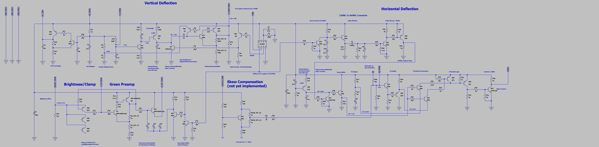

#
Change Log:
* 4/5/2026 - Update to schematic 20260405A. Incorporates capacitive coupling between vertical deflection accumulator and amplifier and associated output-referenced clamp. Coarse adjustment pot for vertical size removed and replaced with fixed resistors. V1 of horizontal section changed to fixed voltage with Schottky diode. Ramp buffer converted to NPN follower for improved thermal stability (always far from saturation region). In RGB section, introduced output-referenced active clamp with simplified brightness supply. VHF/UHF BJTs incorporated into amps. Created unity-gain buffer section with pulldown for sync-tip insertion. Minor value tuning to accomodate reversion to original CC flyback (157-0146) and associated change of B+ from 86V to 68V.   

# Horizontal Section
 
The high-level function of the horizontal section is to take the composite sync signal provided on the Color Classic analog board ("AB"), extract a horizontal sync signal, and then use that to generate the horizontal deflection pulse within the required range of duty cycle. The horizontal deflection pulse is used to ultimately pulse the horizontal output transistor on the AB.
  

## Signal Chain:
 
* The LM1881 IC is used to provide a DC-coupled, approx 0-6V composite sync ("CSYNC") signal, using the AB's AC-coupled CSYNC singal as input. The LM1881 provides other functions that will be described in later sections. But here, the "copy" of the CSYNC signal is useful as a low-ouptut impedance input to the horizontal circuitry. The CSYNC falling edge represents the start of a scanline.  
* CSYNC pulls a simple voltage regulator of two 3.3V Zener diodes to ground when high with a BJT inverter, conversely producing 6.6V at the falling edge.  
* The 6.6V pulse is buffered and drives a simple edge detector comprised of an RC network. A quickly decaying exponential pulse results (about 1μs in duration), independent of the duty cycle of the CSYNC input. This allows the circuity to generate all pulses nearly equally in amplitude and duration, whether the input pulse is at the start of the scanline or during the vertical sync period when the duty cycle is larger.  
* Two BJTs are used to "clean" and buffer the pulse into a more digital signal. In effect, this generates a horizontal sync ("HSYNC") signal.  
* Independently, a BJT current source (referenced to the 8V rail) linearly charges a 100nF accumulator capacitor to produce a linear voltage ramp.  
* The HSYNC pulse is then used to reset the accumulator to ground potential at the horizontal frequency at the start of every scanline. The resulting sawtooth waveform is buffered by an NPN BJT, with an output voltage between 0V and 3.2V. Because of negative Vbe offset, the sawtooth remains at 0V for a relatively long duration of the cycle.  
* Two reference voltage ("V1" and "V2") are generated by different methods. V1 is a simple, low, fixed DV voltage of 0.36V produced with a Schottky diode and resistors. A voltage divider uses Pin 40 (the "horizontal shift") signal as input for V2 generation, with gain reduction from the 5V rail (described in a later section) and pull-up resistor. The nominal voltage generated by this gain-reducing divider, and Pin 40 itself, is 1.6V, which is the approximate voltage buffered by the downstream V2 source (~1.8V) The double-buffering of V2 with opposite BJT polarities was found to be quite temperature stable relative to other configurations.  
* Two BJTs serve as comparators between the sawtooth waveform and the V1 and V2 reference voltages. Their collectors pull low to their reference voltages as the sawtooth crosses their respective values (plus Vbe).  
* The V1 comparator pulls a switching PNP BJT's base low at the first crossing, while the V2 comparator pulls it back to high with a second BJT on the second crossing (threshold logic). This generates a voltage pulse that is timed according the precise voltages of V1 and V2, with V2 dependent on the exact voltage at Pin 40 (allowing slight modulation with the HS potentiometer on the AB). The nominal timing difference between the first and second crossing should be around 11μs for proper operation of the horizontal deflection, but there is some significant tolerance. More importantly, the Pin 40 voltage modulates V2, which directly affects the timing of the second crossing, and thereby affects the overall phase of the horizontal scan in relation to CSYNC.  
* The switching of the threshold logic BJT is inverted and buffered by another switching BJT. This signal is applied to Pin 32, which drives a MOSFET on the AB and ultimately drives the rest of the horizontal section. The timing of the rising edge of this final output pulse controls the phase of the horizontal scan in relation to all other signals (especially the video signals). This edge should occur about 28μs after the falling edge of CSYNC in order to have a well-centered image (at 31.5kHz horizontal scan frequency).
   

## Considerations:
 
* It may be clear from the description of the signal path above that much of the horizontal circuity is a kind of "one-shot" timer that converts an HSYNC pulse train into another "digital" pulse with a particular delay and duty cycle. As such, there are many ways of implementing this functionality. I've chosen to use mostly discrete components and build from low-level functionality. This has given me a lot of control over the behavior of the circuitry. But timing of the final horizontal drive pulse, as well as the voltage level and output impedance are important.  
* Like the other sub-circuits, the supply voltage is 8V from the Pin 22 position. This appears to be the main rail for powering the XCll86B, though there appear to be other supply voltages (more on that later). The grounding approach for all the sub-circuits is especially important for avoiding video artifacts. Through experimentation, I've found that associating all the horizontal circuitry with Pin 31 ground (#3 in my schematic) is best, which is physically closest to the pins associated with the horizontal section.  
* A lot of trial and error was employeed to make the timing stable, especially with respect to temperature. Use of accumulator capacitors with low temperature sensitivity is particularly important, as well as using a small voltage rise. The high linearity and lower temperature sensitivity outweigh any SNR benefit in this regime. Having a very stable "V2" is also critical, and I found that the dual-stage regulator/buffer was necessary to achieve this. Small changes in the Vbe of each BJT can contribute to temperature-sensitive drift in all of the circuitry, so paired NPN/PNP stages help to null out this effect, as well as to reduce base current in general, leading to more stable Vbe.  
* A capacitor was originally connected in parallel with R45, in order to slow the discharge of the base voltage on Q21. The purpose of this was to avoid a short secondary pulse at the output when the sawtooth waveform falls sharply on the negative edge, switching the threshold circuitry in reverse order. These events happen on the time scale of a few microseconds, and as such, Q21 is discharges its base slowly enough without an additional discrete cap. The use of a relatively large resistance on R45 provides some discharge function (necessary to "reset" the circuitry quickly engough for the next cycle), but is slow enough to avoid generating the secondary pulse.  
* All BJTs used are S8050s (NPN) or S8550s (PNP), unless otherwise noted. These are well matched BJTs that are reasonably fast for this application and have good gain. The final output transistor at Q22 requires a little more collector current handling, and I've opted for FMMT449. This part is also used for the discharge transistor for the accumulator. A more complete recommended parts list will be provided in another section.  
* It's very likely that the XC1186B has PLL capability built-in, and it uses this in conjunction with feedback of the flyback pulse on Pin 35 to maintain alignment between the actual horizontal scan timing and HSYNC. As such, the horizontal drive pulse would not be nominally fixed relative to HSYNC, as my circuitry aims to do, but modulates the timing slightly to keep the flyback pulse fixed. Various aspects of the horizontal circuity can affect the actual horizontal scan timing relative to the drive pulse, especially width modulation. Width modulation is handled by the TDA8145 and an associated width control inductor, LL3. Pincushion correction is a special case of width modulation, in which the TDA8145 uses the vertical deflection waveform as input and varies the horizontal width as a parabolic function of the vertical scan position. As such, the horizontal timing is slightly skewed proportional to the magnitude of the pincushion correction, resulting in a slight curvature in the image in the shape and direction of a right-parenthesis. As alluded to earlier, this is likely nulled out by the feedback of the flyback pulse provided to the XC1186B and its PLL. But my circuity currently doesn't make use of this feedback, and the resulting curvature is visible. I've found that a simple (open-loop) and straightforward correction can be made by using the TDA8145's width modulation signal on its Pin 5 as input to an inverter/level-shifter BJT, mixing its positive and negative ouptus with a 2k pot, then capacitively coupling that singal into Pin 40 ("HS"). In effect, this provides slight modulation of the horizontal shift in some proportion (user-adjustable via the 2k pot) to the pincushion correction waveform. This is shown in the schematic section labeled "Skew Compensation". While I haven't yet implemented this feature on the PCB, I've prototyped it on a breadboard and tested it. The compensation is quite effective and stable, and the pot gives the user another degree of freedom for image correction. Unfortunately, the use of TDA8145's Pin 5, which is not normally provided to the XC1186B, would mean that this custom circuitry is not a pin-for-pin drop-in solution, in the strictest sense. A bodge wire from the TDA8145 is required. Fortunately, this is a simple rework, and could even be routed to a now unused pin from the original XC1186B footprint, such as Pin 5, which has only a 33k resistor to ground. As a parasitic load, this resistor is fairly insignificant to the operation of the circuit. My future implementations of the custom PCB will likely take this approach. 
   

# Vertical Section
 
The vertical section's main function is to generate a sawtooth waveform that represents the beam displacement from the top of the display to the bottom, with the lowest voltage value representing the start of the scan at the top. This waveform drives the TDA8172, which is a sort of high-power opamp that directly drives the vertical deflection coil. Other sections of the AB also make use of the vertical deflection waveform, as discussed below. From probing the output of the original XC1186B, it was found that the vertical deflection sawtooth ranges from about 1.5V to 5.4V, with a high degree of linearity.
  

## Signal Chain:
 
* The LM1881 IC is used to generate a VSYNC signal, extracted from the AC-coupled CSYNC provided by the AB on the Pin 6 position.  
* Independently, a simple current source and a 0.3 microfarad accumulator capacitor generate a linear voltage rise of about 1V over a single 60 Hz refresh period. The exact current is adjustable by way of the AB's "VH" potentiometer, which is input on the Pin 39 position. VH forms a voltage divider with a 3.3V Zener-regulated supply, the output of which modulates a level shifter that drives the BJT current source.  
* The voltage on the accumulator capacitor is reset to ground with a BJT that's driven by the VSYNC signal as a triggering pulse. The video processor's 5V supply piggybacks off this regulator's Zener reference, and provides 5V output on the Pin 7 position.  
* The amplitude of the accumulator capacitor is intentionally kept low (1V as described above) in order to maintain high linearity of voltage with respect to time.  
* The final output sawtooth waveform requires a non-zero trough voltage of about 1.3V, though there is some tolerance on this. In order to achieve this voltage (corresponding to the "reset" state of the circuit) and produce a sufficient offset for the subsequent amplifier stage (described below), capacitive coupling between the accumulator and amplifier stage is employed with clamping. The clamping implementation measures the output of the amplifier stage during the trough with a BJT, using a simple 1.95V voltage divider (from the 3.3V supply) as the supply and reference voltage. This allows it to recharge the coupling cap to a relatively small voltage precisely, nulling out drift in the Vbe of the amplifier stage while requiring very little current from the 1.95V supply.  
* The accumulator's signal is then amplified by a dual-BJT feedback amplifier with a gain of 4x. The output of this stage produces the 1.3V to 5.4V sawtooth waveform required as input to the downstream circuitry of the AB, including the TDA8172. The "VH" potentiometer on the rear of the AB allows for fine-tuning of the image height, just as would be the case with the XC1186B. 
   

## Considerations:
 
* As mentioned, keeping the accumulator amplitude low was important to maintain good linearity and temperature stability. D3 in the level shifter also helps in this regard by matching and nulling out much of the thermal drift in Vbe on Q3. Having a reliable and stable current source is important for this implementation.  
* The exact value of the trough of the vertical sawtooth waveform is not especially critical, as the output of TDA8172 is capacitively coupled to the vertical deflection coil, though it's important to not saturate the voltage on peak of the waveform. DC is restored separately at the TDA8172, and the vertical shift, "VS", potentiometer and associated circuitry on the AB contribute to this function. As such, VS still works as it normally would. As mentioned, other parts of the AB use the vertical sawtooth as a signal representing the vertical beam position, notably the TDA8145, which accepts it as input for pincushion correction (horizontal scaling as function of vertical position). Changes in the DC level ultimately result in modulation of the keystone geometry. The TDA8145 can account for this and add its own DC reference by way of the keystone correction potentiometer on the rear of the AB. A trough voltage of around 1.3V was empirically found to be suitable for all functions.  
* Like in the horizontal section, using the appropriate ground connections is important. I'm using a mix of Pin 31 and Pin 12 ground connections on the prototype PCB. It turned out to be a fortunate choice, as these two are nearly equivalent, being in very close connection on the AB and seemingly associated with the original XC1186B's vertical functions. There were some initial uses of the Pin 21 ground, though this was fortunately easy to fix with bodges, resolving some initial video artifact problems.  
* The 5V supply in the vertical section leverages the nearby 3.3V Zener supply as a reference, multiplying it (minus the Vbe of the input BJT) with a 2x gain to achieve ~5.4V. This was found to be slightly better performing that than a nominal 5.0V, possibly because the TDA8172 uses the 5V rail as a reference voltage. Shifting the reference slightly higher than the peak voltage of the vertical sawtooth waveform prevents the appearence of some geometry artifacts at the bottom of the vertical scan. The 5V rail is used in multiple locations throughout the video circuitry, so it's an important supply. Stability is especially important for the TDA8172, as fast fluctuations result in a visible "bounce" in the vertical size of the image as the TDA8172 amplifier settles to a new equilibrium. In an earlier design, small changes in the 3.3V supply induced by fluctuations in the 8V rail caused significant bounce, as the quick step-like changes in the 5V rail create ringing in the TDA8172 ouptut. Quick changes in image brightness are especially prone to causing such fluctuations in the 8V rail. A simple fix was to decouple the 5V supply from the 3.3V reference with a long-time constant RC filter. Here, a 22k resistor and 10uF capacitor help significant to reduce the slew rate of the 5V output in response to step changes in the 3.3V reference, allowing the TDA8172 to equilibrate faster than the change in reference voltage. Fortunately, the actual DC value of the 5V rail plays a much less significant role in the TDA8172 output, making it tolerant to such slow but stable changes.  
* Like in the horizontal section, all transistors are either S8050s or S8550s, except in case of Q4, which requires especially high collector current capability for discharge. Again, I've opted for FMMT449. 
   

# RGB Preamp Section
 
Another major function of the XC1186B is to take the low-amplitude, capacitively-coupled RGB signals from the logic board (brought in on connector BV1), add offset for brightness control, amplify them (incorporating contrast control), add sync-tips, and deliver the output to the downstream cathode amplifiers. Interaction with the other sub-functions of XC1186B seems to be fairly limited, with the exception of sync-tip insertion driven by the timing of the sync signals. My implementation is fairly straightforward, making use of dual-transistor class-A amplifiers for each color channel, though the choice of biasing resistors and BJTs was important to provide high bandwidth for crisp image production. There are some nuances in the clamping/brightness circuitry, as well as the sync-tip insertion circuitry, discussed below. Schematically, only the green channel circuitry is shown for simplicity. The other color channels are duplicates of what is shown, though some components have single instances (brightness supply, sync-tip buffer, etc.). For clarity, some of the repeated components are shown as such, with the associated connections to the Red and Blue channels not explicity shown.
  

## Signal Chain:
 
* RGB signals are brought in from Pins 14,16,18, with capacitive coupling and 75Ohm termination provided right on the AB prior to connections at the XC1186B pins. These connections are connected to both the amplifier stage and to brightness-control/clamp circuitry, described below.  
* The amplifier stage for each channel is comprised of an NPN input BJT and PNP output BJT. These are high-speed VHF/UHF BJTs, part numbers MMBTH10L and MMBTH81. A 4.7K pull-up resistor at the base-emitter connection of the PNP greatly improves speed (reducing image smear) by discharging the PNP's base quickly on falling signals, at the cost of a small reduction in the effective gain. The resistor divider on the output, which currently includes 2k trimmer pots on the PCB, determines the amplifier gain (effectively, the image contrast), with a range of about 1x to 5x.  
* The output of the amplifier stage feeds back to a PNP BJT for active clamping of the capacitively coupled input, as mentioned above. The BJT effectitvely compares the minimum output value (during black-level display) against a reference voltage that also serves as a supply for the clamp. The reference voltage is a divided-down version of the brightness signal itself, provided on Pin 20, with a range of about 1.9V to 2.7V. The brightness signal can be modulated by the logic board, via the Color Classic's brightness control in the "Screen" Control Panel, in addition to other software-controlled interfaces. By measuring against the amplifier output, the clamping circuitry charges the coupling cap to the appropriate level on each scanline, independent of the amplifier gain or other offsets. It's especially good at nulling the drift in the input BJT's Vbe offset and its associated amplified offset, which can be quite large. Charging the coupling cap requires very little current, as as such, the upstream brightness supply does not require additional buffering.  
* The amplifier output is "lightly" coupled to the downstream circuitry by way of a 470 Ohm resistor. Downstream of it is another MMBTH10L, acting as a simple unity-gain buffer. The base input of this buffer also serves as a node to pull down during sync-tip insertion, without excessively loading or affecting the amplifier stage. The sync-tips are zero-voltage pulses that match the timing and duration of the CSYNC signal, and are used in the downstream cathode drive circuitry for DC restoration. In effect, they serve as a fixed reference voltage to the black level set by the brightness/clamp circuitry. A cascade of two BJT inverters is used to condition the CSYNC signal from the LM1881, which pulls down the unity-gain buffer's base low during the sync pulse period. A single set of inverters services all three color channels, isolating the output of each associated buffer through individual Schottky diodes. 
   

## Considerations:
 
* The 2k pots on the PCB offer direct control of the image contrast for each channel, but are not ideal solutions for a few reason. One is that they are not readily accessible with the RF cage in place, making casual fine adjustment impractical. Another problem is that the gain range is quite large, and it might be initially difficult to find the ideal contrast (in conjunction with optimal brightness, G2 setting, background, etc). In practice, using 2.8x as a starting gain value seems about optimal (with ".._POT_LO" equal to about 400 Ohms). Also, I currently have nothing in the design that allows for overall contrast control by way of the "Screen" Control Panel or the Color Classic's front contrast buttons. These settings modulate the voltage on Pin 19, but I currently don't make use of that signal. Similarly, the Green Gain and Blue Gain controls on the AB's set of rear potentiometers are also not functional. Using an external voltage to control amplifier gain in a linear fashion is not straightforward, though I hope to implement this in the future, possibly obviating the need for the on-board gain pots.  
* The value of the coupling resistor R23, between the amplifier stage and the buffer stage, was chosen as a sort of compromise. Larger values allow the sync-tip insertion circuity to more easily pull down the signal without loading the amplifier's output, but it would create a significant voltage drop between the two stages. The output of the entire RGB section drives 330 Ohm termination resistors (RV7, RV8, and RV9 on the AB), requiring up to about 13mA of current for bright parts of the image. Assuming the current into the buffer stage is about 1% of that, the 470 Ohm coupling resistor has about 63mV of voltage drop. This is not an insignficant drop as it is, and increasing the resistor's value would only add further signal attentuation. However, smaller values would present more of a current load during sync-tip insertion, loading the amplifier while possibly affecting the clamping circuitry.  
* Schottky diodes were chosen for the isolation of the sync-tip pulldown due to their low forward voltage-drop. This brings the sync-tip level very close to zero, but not quite. Other implementations could provide an improvement, but with higher part count or complexity, such as by utilizing individual pulldown BJTs (Q32) for each channel. Another consideration for the use of Schottkys is that, while they are quite fast, they do have a small capacitance that requires discharge to fully turn them off. The 22k resistor at R74 was found to be optimal to bring the Schottkys' cathodes high after each sync-tip without excessively loading Q32.  
* In general, the RBG circuitry is fairly sensitive to biasing and particular values of components. The bandwidth needs to be quite high (~100 MHz or higher), requiring fast BJTs and quick charge/discharge of parasitic capacitances. Signal cleanliness is also extremely important, including proper grounding and use of the specified AB ground pins. Artifacts in the RBG signals are readily visible in the displayed image. A lot of trial and error and analysis of the RGB circuitry has been done to optimize performance. 
   
